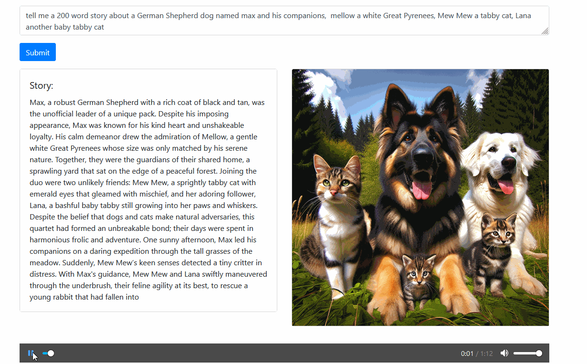

# Story Teller Web App

## About The Project

Story Teller is an interactive web application that generates stories with text-to-speech (TTS) and associated images using the OpenAI API. It transitions images as the story is being told, creating a dynamic storytelling experience. Great for kids and adults alike!



### Built With

This section should list any major frameworks/libraries used to bootstrap your project. Leave any add-ons/plugins for the acknowledgements section. Here are a few examples.

- [Laravel](https://laravel.com)
- [OpenAI API](https://openai.com/api/)
- [jQuery](https://jquery.com)

## Getting Started

This is an example of how you can set up your project locally. To get a local copy up and running, follow these simple steps.

### Prerequisites

This is an example of how to list things you need to use the software and how to install them.

```bash
npm install npm@latest -g
```


### Getting Started

1. Clone the repo

```bash
git clone
```

2. Install Composer packages

```bash
composer install
```

3. Install Laravel Mix

```bash
npm install
```

<p align="center"><a href="https://laravel.com" target="_blank"></a></p>

4. Create a copy of your .env file

```bash
cp .env.example .env
```

5. Generate an app encryption key

```bash
php artisan key:generate
```

6. Create an empty database for our application

7. In the .env file, add database information to allow Laravel to connect to the database

8. Migrate the database

```bash
php artisan migrate
```

9. Seed the database

```bash
php artisan db:seed
```

10. Run the application

```bash
php artisan serve
```

## Usage

Type in a prompt and click "Generate Story" to generate a story. Click "Generate Story" again to generate a new story. Click "Play Story" to play the story. Click "Pause Story" to pause the story. Click "Reset Story" to reset the story.

## Roadmap

See the [open issues](  ) for a list of proposed features (and known issues).

## Contributing

Contributions are what make the open source community such an amazing place to be learn, inspire, and create. Any contributions you make are greatly appreciated.

1. Fork the Project

2. Create your Feature Branch

```bash
git checkout -b feature/AmazingFeature
```

3. Commit your Changes

```bash
git commit -m 'Add some AmazingFeature'
```

4. Push to the Branch

```bash
git push origin feature/AmazingFeature
```

5. Open a Pull Request

## License

Distributed under the MIT License. See `LICENSE` for more information.

## Contact

Please contact me at [galindo.tech@gmail.com ](mailto:galindo.tech@gmail.com ) if you have any questions or concerns.


